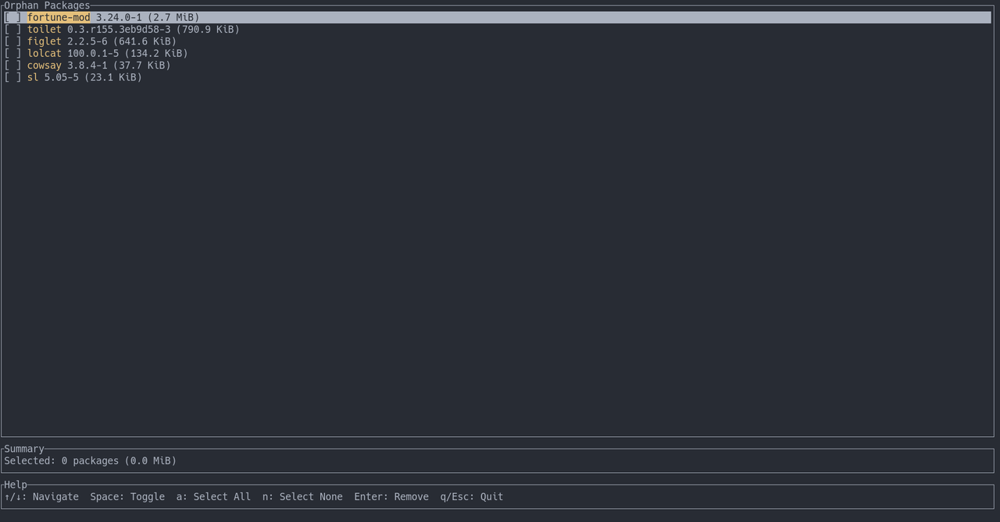

# dude

`dude` finds and removes orphan packages on Arch Linux.

It is a small wrapper around `pacman` with a TUI, a dry-run-friendly CLI, and a safer default workflow than pasting package lists into shell one-liners.



## Installation

### AUR

```bash
yay -S dude
```

### From source

```bash
git clone https://github.com/marawny/dude
cd dude
cargo build --release
sudo install -Dm755 target/release/dude /usr/local/bin/dude
```

## Usage

List orphan packages:

```bash
dude list
```

Open the interactive TUI:

```bash
dude
```

Preview removal:

```bash
dude prune
```

Remove all detected orphans:

```bash
dude prune --yes
```

Keep packages matching a regex for one run:

```bash
dude --keep '^linux.*' prune
```

## Commands

```text
dude list
dude tui
dude prune [--yes] [--dry]
dude auto
```

## Configuration

Config files are loaded from:

- `/etc/dude.conf`
- `~/.config/dude/config`

Example:

```toml
whitelist = [
  "base-devel",
  "linux-headers",
]

[auto_prune]
threshold_mb = 100
days_since_last_run = 7
```

## Pacman hook

Install the bundled hook to list new orphans after upgrades:

```bash
sudo cp hooks/dude.hook /usr/share/libalpm/hooks/
```

## Notes

- `dude` targets Arch Linux and shells out to `pacman`.
- Orphan detection follows `pacman -Qdttq`.
- The default `prune` flow is non-destructive unless you pass `--yes`.

## Development

```bash
cargo fmt --check
cargo test
cargo clippy --all-targets --all-features -- -D warnings
```

## License

Licensed under either of:

- MIT
- Apache-2.0
